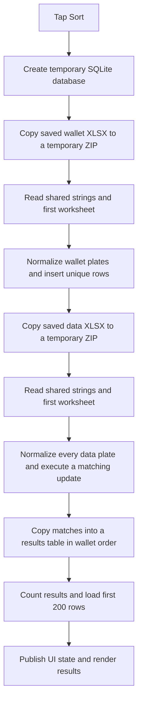
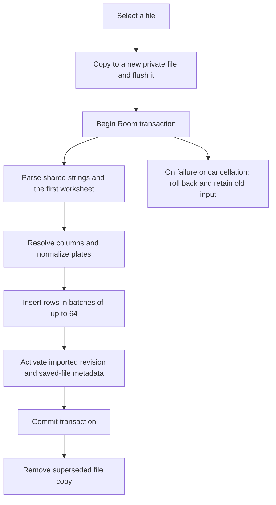
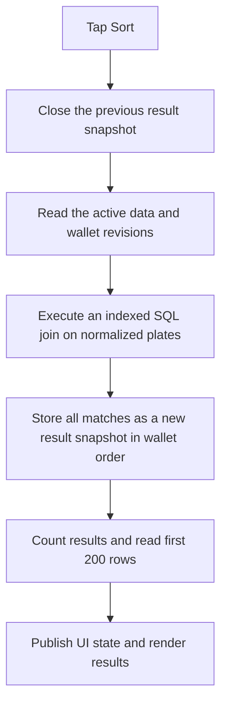

# How sorting works: before and after the performance changes

Date: 2026-09-20

The change primarily accelerates **sorting files that have already been imported**.
Selecting a file still requires copying, reading, and importing it. Those steps
can take seconds or longer. The reported 81 ms result measured repeat matching
and the first database page, not the complete experience from selecting files to
seeing results on a phone.

You reported that performance is still poor. That means the emulator benchmark
has not established that the experience with your actual files is satisfactory.
The exact cause of that remaining delay has not yet been measured on your device.

## 1. What “sorting” means in this app

This operation matches vehicle plates rather than alphabetically sorting rows:

1. Read the first worksheet of the data file and the wallet file.
2. Find the plate columns using supported Arabic header aliases.
3. Normalize plates: remove whitespace, normalize selected Arabic letters and
   digits, and pad the number portion to four digits. Skip invalid plates.
4. Keep the first occurrence of each normalized plate in each input.
5. Return data records whose plates occur in the wallet, in wallet order.
6. Include the wallet type alongside the matching data fields.

These matching rules remain the same after the changes. Pasted plates can replace
the wallet input for a particular sort without replacing the saved wallet file.

## 2. Before the changes

This describes the implementation immediately before the indexed-import change.
Room already remembered the two selected files, but stored only their metadata.
The Excel files themselves were copied into persistent private app storage.

### When selecting a file

The app copied the file into `filesDir/saved_files`, saved its filename and other
metadata in Room, and removed the previous copy after successful replacement.
It did not save parsed worksheet rows for reuse.

### Every time the user tapped Sort



The temporary database had an indexed wallet table. For each data row, the app
issued an update against the matching normalized wallet plate, filling its data
fields only if they had not already been populated. A final SQL statement copied
the matches into a results table.

**The old path already used an index.** It was not comparing every data row with
every wallet row in a nested loop. Much of its repeated work came from reopening
Excel files, processing XML and shared strings, normalizing rows, and issuing
individual database updates.

An XLSX file is a ZIP archive of XML files. Reading it involved:

- Making an additional temporary copy, even for an app-owned local file.
- Resolving the first worksheet through workbook metadata and relationships.
- Reading the workbook's shared-string table into temporary disk files.
- Using many small, unbuffered writes and a small string cache.
- Parsing worksheet cells, resolving shared-string references, and building row maps.

The temporary matching database and parsed-string files were discarded when their
work was finished. Running Sort again repeated the import and matching work.

## 3. After the changes

The app separates **importing files** from **matching imported rows**.

### A. Selecting or replacing a file



The data file's usable rows go into `sorting_data`. The wallet's usable rows go
into `sorting_wallet`, including their original sequence. Composite primary keys
on revision and normalized plate provide lookup indexes and first-occurrence
deduplication.

The app imports all usable data rows, not just rows matching the current wallet.
This allows a different wallet to reuse the data file without parsing it again.
It also means import involves storing a potentially large dataset on disk.

File metadata, the active import revision, and the parsed rows are committed
together. A failed import preserves the previous input. Replacing one file does
not re-import the other.

**Reselecting the same original file still triggers a full import.** Each selection
creates a new private filename and therefore a new revision. There is currently
no content-hash comparison to recognize an identical reselected file.

### B. Opening the sorting screen

`SortingViewModel` calls `SortingRepository.loadInputs()` and checks the saved
input revisions. If the filename/revision and parser version match, existing
parsed rows are reused without reading the Excel file again.

Files saved before this change require a one-time import. An import-version change
also requires rebuilding the derived rows. On those occasions, opening the screen
can take time before sorting becomes available.

### C. Tapping Sort after import



The matching query has this structure:

```sql
INSERT INTO sorting_results (...)
SELECT ...
FROM sorting_wallet AS w
JOIN sorting_data AS d
  ON d.revision = :dataRevision
 AND d.normalized = w.normalized
WHERE w.revision = :walletRevision
ORDER BY w.sequence;
```

No Excel file is read in this path. For pasted wallets, the app first normalizes
the pasted lines into temporary wallet rows; it removes those rows in the same
transaction after matching.

Each sort still creates a fresh result snapshot containing **all matches**. It
does not reuse the last result snapshot just because the inputs are unchanged.
The UI initially reads 200 rows and loads additional pages as needed. Copying,
saving, and sharing use the same snapshot, which remains stable if an input is
subsequently replaced.

### D. Saving or sharing Excel results

Export is a separate operation. The app reads all matching rows in pages and
writes a new compressed XLSX file. Sharing then launches Android's app chooser
with that file. Export time is not included in the repeat-sort benchmark.

## 4. What changed inside the Excel reader

| Area | Before | After |
| --- | --- | --- |
| Opening private files | Copy to another temporary ZIP | Open directly |
| Shared-string writes | Small unbuffered random-access writes | Buffered sequential writes |
| Shared-string memory cache | Up to 256 entries | Estimated 4 MiB budget and at most 8,192 entries |
| Shared-string disk reads | Primitive reads with multiple small operations | Read offset/length bytes in blocks |
| Worksheet values | Resolve values for all columns | Skip unused column-value decoding after identifying headers |
| Column aliases | Repeated lookup during matching | Resolve import field mappings once per file |
| Plate normalization | Repeat on every sort | Normalize during import; reuse stored keys |
| Whitespace regex | Constructed repeatedly | Reused compiled regex |

These changes reduce import overhead. They do not eliminate XLSX decompression,
XML traversal, string processing, or database writes.

## 5. Why it can still feel slow

The following are remaining costs visible in the implementation, not confirmed
diagnoses for your particular files:

| Situation | Work that still happens |
| --- | --- |
| Selecting a file | Full copy, flush, parse, normalization, and database import |
| Selecting the same file again | Full replacement/import because its private revision changes |
| First screen opening after upgrading | One-time import of previously saved files |
| Large shared-string table | The reader processes the workbook-wide string table, even when only the first worksheet and a few columns are needed |
| Many unused columns | Value decoding can be skipped, but worksheet XML still has to be traversed |
| Long notes or many matches | Larger database writes when importing and materializing result snapshots |
| Another import or sort is running | Repository operations wait for the shared operation lock; imports also hold a database transaction |
| Repeating the same sort | A new snapshot is written, the previous snapshot is deleted, and results are counted again |
| Displaying results | State delivery, Compose layout, text measurement, and rendering occur after the database work |
| Saving or sharing results | All matching rows must be written into a new XLSX archive |

Import progress is reported every 1,000 worksheet rows. Before that, copying and
processing the shared-string table can take time without increasing the displayed
row count. A stationary row counter does not necessarily mean the app has stopped.

Compressed file size is also an incomplete predictor: a small XLSX can expand to
a large amount of XML and text.

## 6. What the benchmark actually showed

Synthetic files were tested on an Android 17 x86_64 emulator using a debug build.
Repeat-sort values are medians of three runs; import values are single samples.

| Data rows / wallet rows | Original repeated sort | Room repeated sort after import | New import, including private copies |
| --- | ---: | ---: | ---: |
| 10,000 / 1,000 | 3.818 s | 0.029 s | 2.444 s |
| 100,000 / 10,000 | 35.782 s | 0.081 s | 21.344 s |

The repeated-sort timer included repository matching, writing the result snapshot,
counting matches, and reading the first 200 rows. It excluded file selection,
import, previous-snapshot deletion by the ViewModel, UI rendering, and export.
The original sort timer also excluded the initial persistent file-selection copy.

For the larger case, adding the separately measured import and matching phases
gives roughly **21.4 seconds**, before UI overhead. That illustrative sum is not
an independently measured end-to-end time. It shows why **81 ms does not describe
the experience of selecting new files and then sorting them**.

The previously reported 442x improvement applies to the repeat matching phase
against the original baseline. It is not a 442x improvement for every action,
nor a guarantee for your phone or workbooks. Physical-device timings and the
specific slow interaction you reported remain unmeasured.

## 7. What should be measured next

To identify the remaining delay, record separate start/end timestamps for:

1. Source-file access, private copying, and flushing.
2. Shared-string parsing and first-worksheet parsing.
3. Row normalization, database insertion, and transaction commit.
4. Waiting for the operation lock and deleting the previous snapshot.
5. SQL matching, snapshot creation, count, and first-page loading.
6. Time from tapping Sort to the first rendered result on the actual device.
7. Excel generation and opening the share chooser, if that is the slow action.

Compare selecting new files, reselecting the same files, sorting unchanged files,
replacing only the wallet, and reopening the app. The next optimization should be
chosen from those measurements rather than assuming the emulator's database
timing explains the reported delay.

## 8. Relevant implementation files

- [Import and matching orchestration](../feature/sorting/src/main/java/com/rased/feature/sorting/data/SortingRepository.kt)
- [Previous temporary-database matcher, retained for comparisons](../feature/sorting/src/main/java/com/rased/feature/sorting/data/SortingStore.kt)
- [Room tables and matching query](../core/database/src/main/java/com/rased/core/database/SortingTables.kt)
- [Persistent file copying and commit](../core/database/src/main/java/com/rased/core/database/SavedFileStorage.kt)
- [Excel parsing and shared strings](../core/excel/src/main/java/com/rased/core/excel/XlsxReader.kt)
- [Result paging and export](../feature/sorting/src/main/java/com/rased/feature/sorting/data/RoomResultStore.kt)
- [Screen lifecycle and loading states](../feature/sorting/src/main/java/com/rased/feature/sorting/ui/SortingViewModel.kt)
- [Original benchmark output](sorting-benchmark-results.txt)
- [Production Room benchmark output](sorting-room-benchmark-results.txt)
